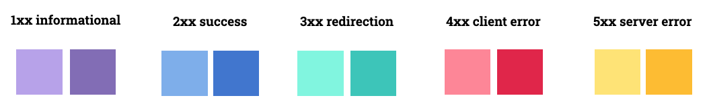
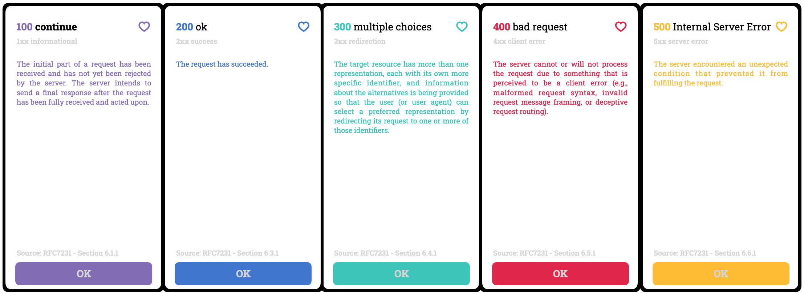

# Nice Reference: HTTP Status Code 
A reference iOS app to show all status codes you can get: Success, errors, teapots and more :)

## Idea and inspiration 💡
Inspiration from this amazing website https://httpstatuses.com that made a wonderful job!     
After looking on the app store I could not find any application with HTTP references. Maybe is not the most useful app to have, but I thought I could make it visually appealing (like the http statuses website!) and improve my testing skills along the way. 
&nbsp;     

## Resources
### All Information is on a .json file
I created a Json file with the information I need: Code, type, description and reference. [Click here](https://github.com/juliaYamamoto/App_httpStatusCode/blob/main/httpStatusCode.json) to open it! 
If you want to, you can save and use wherever you want **BUT remember to give credits to https://httpstatuses.com.** I made the file, but the website is where all the easy and nice information came from!

The json have an **array of dictionaries**. Each one have a **key** string with the type of code (That can be: *1xx informational, 2xx success, 3xx redirection, 4xx client error, 5xx server error*.) and the **value** is an array with the codes for that type.

**Each element have:** (All with string values).    
&nbsp;&nbsp; **code:** status code. *e.g.: 418*.    
&nbsp;&nbsp; **title:** status title. *e.g.: I'm a teapot*.    
&nbsp;&nbsp; **description:** a small description. *e.g.: Any attempt to brew coffee with a teapot should result in the error code '418 I'm a teapot'.*.    
&nbsp;&nbsp; **type:** type of the status code. *e.g.:4×× client error*. (Again. Yes. My json my rules.)      
&nbsp;&nbsp; **source:** reference code and section. *e.g.:RFC2324 Ssection 2.3.2*.    

### General look - first draft
This first draft was made using keynote.            

#### 🎨 Color
Each type have a different color.     

#### 🔡 Font.    
[Roboto Slab](https://fonts.google.com/specimen/Roboto+Slab) designed by Christian Robertson under the [Apache License, Version 2.0.](http://www.apache.org/licenses/LICENSE-2.0).    

#### 📱screens.    
**Main screen**.            
Show a table view with all the status code separated in sections by type. The user can search for a specific one by **type**, **code** or **title** 

**Details screen**.       
Showed when a cell on the main screen is selected. Contains information about the selected code.      

